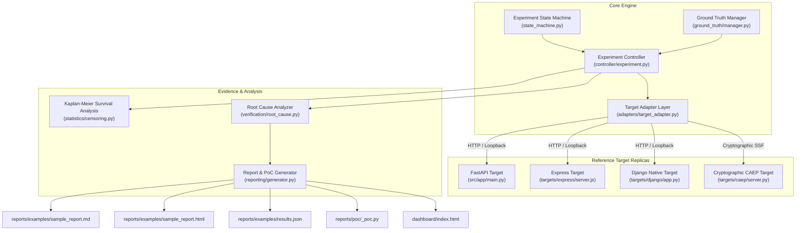

# AuthTime

> **An open-source controlled security research harness for experimentally measuring and quantifying Temporal Authorization Exposure Windows ($\Delta t_{\text{exp}}$) during access revocation fault injection.**

<p align="center">
  
</p>

<p align="center">
  <a href="https://github.com/Saisandeep05/AuthTime/actions"></a>
  <a href="LICENSE"></a>
  <a href="https://www.python.org/"></a>
  <a href="#-safety-boundary--constraints"></a>
  <a href="#-verified-project-status"></a>
</p>

**Tech Stack**: `Python 3.12` • `FastAPI` • `PostgreSQL` • `Redis` • `Django` • `Express.js` • `OpenID CAEP/SSF` • `JWT` • `HTTPX` • `Pytest` • `Hypothesis` • `Docker`

<details>
<summary><strong>📚 Table of Contents</strong> (Click to Expand)</summary>

- [⚡ What AuthTime Does](#-what-authtime-does)
- [🚀 Quick Start (START HERE)](#-quick-start-start-here)
- [🔄 End-to-End Execution Workflow & Lifecycle](#-end-to-end-execution-workflow--lifecycle)
- [📊 Understanding the Results](#-understanding-the-results)
- [🏗️ System Architecture & Data Flow](#-system-architecture--data-flow)
- [⚡ Advanced Features (Optional)](#-advanced-features-optional)
  - [1. Using the `authtime` CLI](#1-using-the-authtime-cli)
  - [2. Distributed Authorization Validation Laboratory](#2-distributed-authorization-validation-laboratory)
  - [3. Real-World Employee Offboarding Case Study](#3-real-world-employee-offboarding-case-study)
  - [4. Advanced Validation Tools (`scripts/`)](#4-advanced-validation-tools-scripts)
  - [5. Supported Target Frameworks](#5-supported-target-frameworks)
- [📂 Repository Map](#-repository-map)
- [📘 Technical Documentation & Research](#-technical-documentation--research)
- [🛡️ Safety Boundary & Constraints](#-safety-boundary--constraints)
- [📜 License](#-license)
</details>

---

## ⚡ What AuthTime Does

When an administrative user's privileges are revoked in a primary database (due to employee termination, role demotion, or security compromise), distributed microservices and web applications often **fail to immediately enforce revocation**. 

Applications continue accepting unauthorized requests during a silent **Temporal Authorization Exposure Window** ($\Delta t_{\text{exp}}$) caused by:
1. **Stale In-Memory Caches**: Application workers caching user permissions until a local TTL expires.
2. **Unrevoked Stateless JWT Tokens**: Valid cryptographic signatures accepted until token expiration (`exp`).
3. **Asynchronous Propagation Delays**: Back-channel revocation events failing or delayed across message brokers.

<p align="center">
  
</p>

**AuthTime** provides an empirical, automated research harness to inject controlled revocation faults, execute high-precision HTTP probing ($\le 100\text{ms}$ resolution), measure exact exposure windows, and generate standalone proof-of-concept reproduction scripts.

| ⏱️ **Measure Exposure Window ($\Delta t_{\text{exp}}$)** | 🔍 **Classify Root Cause** | 📜 **Generate Standalone PoC** |
| :--- | :--- | :--- |
| Pinpoint exact temporal delay between role revocation and enforcement down to $\le 100\text{ms}$ precision. | Diagnose revocation lag (stale cache, unrevoked JWT, async delay) with confidence metrics. | Automatically output executable zero-dependency Python scripts reproducing findings. |

---

## 🚀 Quick Start (START HERE)

### 1. Install Dependencies

```bash
# Clone the repository
git clone https://github.com/Saisandeep05/AuthTime.git
cd AuthTime

# Install Python dependencies and package in editable mode
pip install -r requirements.txt
pip install -e .
```

### 2. Run AuthTime Main Verification Engine

```bash
python run.py
```

> **What this does**: Automatically starts the local reference FastAPI target application on `http://127.0.0.1:8000`, executes experiment trials, calculates exposure metrics, generates reports in `reports/examples/`, and launches the interactive **Web Control Center & Dashboard**.

### 3. Run Automated Verification Suite

```bash
pytest --verbose
```

> Executes the complete test suite (85 passed, 4 skipped) validating schemas, ground truth, adaptive probing, fault injection, and security invariants.

---

## 🔄 End-to-End Execution Workflow & Lifecycle

AuthTime coordinates a multi-stage experimental pipeline to measure access revocation lag with high precision:

<p align="center">
  
</p>

### How a Request & Trial Flows Through AuthTime (Plain Language)

```text
[ 1. Select Target ] ──► [ 2. Validate Baseline ] ──► [ 3. Inject Revocation Fault ]
                                                                   │
[ 6. Output Reports ] ◄── [ 5. Evaluate Metrics ] ◄── [ 4. Execute HTTP Probes ]
```

1. **Target Selection & Initialization**: AuthTime connects to the target authorization server (FastAPI reference app, Express.js, Django, or Level C Distributed Lab) via the `HTTPTargetAdapter`.
2. **Pre-Fault Baseline Check**: AuthTime issues an initial HTTP request with active user credentials and confirms the target returns `200 OK` (`ALLOW`).
3. **Controlled Fault Injection**: The Ground Truth Manager initiates role demotion (e.g., `Admin` $\rightarrow$ `User`) in the target database at timestamp $t_0$.
4. **High-Precision Probing Loop**: AuthTime fires rapid, monotonic background HTTP probes ($\le 100\text{ms}$ resolution) using `time.monotonic()` to track exactly when post-revocation requests are accepted vs blocked.
5. **Contract & Exposure Evaluation**: Response contracts are evaluated. AuthTime records the time of the last unauthorized `ALLOW` ($t_{\text{last\_unauth}}$) and the first enforced `DENY` ($t_{\text{first\_block}}$), computing $\Delta t_{\text{exp}} = t_{\text{first\_block}} - t_0$.
6. **Report Generation & State Reset**: Formatted Markdown/HTML/JSON reports and executable zero-dependency Python PoC scripts are generated, and target states are reset while preserving forensic audit trails (`AUDIT_EVENTS`).

---

## 📊 Understanding the Results

### Key Exposure Metrics Explained

- **Temporal Exposure Window ($\Delta t_{\text{exp}}$)**: The total duration post-revocation where the target application continues returning `200 OK` (`ALLOW`) for revoked credentials.
- **ALLOW Decision**: The target application accepted a request using revoked credentials.
- **DENY Decision**: The target application correctly blocked the request (`401 Unauthorized` or `403 Forbidden`).
- **Severity Score (0.0 - 10.0)**: Transparent severity score calculated per the auditable formula in [`docs/severity-scoring.md`](docs/severity-scoring.md).

### Report Outputs & Visual Dashboard

After running `python run.py`, inspect output artifacts:

- 📈 [**Interactive Visual Dashboard**](dashboard/index.html) — Open `dashboard/index.html` in any web browser to view interactive timeline charts, probe markers, severity badges, and audit logs.
- 📄 [**Sample Security Report (Markdown)**](reports/examples/sample_report.md) — Formatted audit write-up detailing findings and root causes.
- 🌐 [**Sample Security Report (HTML)**](reports/examples/sample_report.html) — Styled HTML audit artifact.
- 🤖 [**Machine-Readable Telemetry (JSON)**](reports/examples/results.json) — Auditable JSON metadata and raw probe metrics.

---

## 🏗️ System Architecture & Data Flow

AuthTime uses a modular, decoupled architecture where the core measurement engine communicates with target applications exclusively through a standardized **Target Adapter Abstraction Layer**.

### Visual Data Flow Overview

<p align="center">
  
</p>

### Component Architecture Diagram



---

## ⚡ Advanced Features (Optional)

> *The features below are optional for advanced users, infrastructure engineers, and automated CI pipelines.*

### 1. Using the `authtime` CLI

For users who want command-level control or CI integration:

```bash
# Start local reference target server
authtime target start --port 8000

# Execute experiment scenario
authtime run --fault-type stale_cache --repetitions 3 --output-dir reports/examples

# Compare current exposure against historical baseline for CI regression testing
authtime compare --current-exposure 6.0 --threshold 0.5
```

---

### 2. Distributed Authorization Validation Laboratory

AuthTime includes a full **Distributed Authorization Validation Laboratory** (`targets/distributed_lab/`) proving real-world authorization propagation across actual infrastructure components:

- **PostgreSQL Source of Truth**: Authoritative DB storing users, roles, authorization version counters, and revocation audit events (`targets/distributed_lab/db/schema.sql`).
- **Redis Authorization & Invalidation Bus**: Caches user role states and streams invalidation pub/sub events (`targets/distributed_lab/cache/redis_cache.py`).
- **Multi-Replica Protected APIs**: Three independent API instances (`API-1`, `API-2`, `API-3` on ports `8010`, `8011`, `8012`).

```bash
# Launch the Level C Distributed Laboratory using Docker Compose
docker compose -f docker-compose.lab.yml up --build
```

---

### 3. Real-World Employee Offboarding Case Study

AuthTime includes an enterprise case study modeling an offboarding failure for employee `alice` (`Finance Admin` demotion):

```bash
python run.py --case-study
```

- **Vulnerable Baseline**: Due to asynchronous cache invalidation lag, Replica `API-3` allows unauthorized access for **`4.25s`** post-revocation.
- **Engineering Mitigation**: Implemented **Authorization Versioning & Version-Aware Cache Validation** (`auth_version`).
- **Mitigated Outcome**: **`100.0% reduction in observed exposure`** (`0.00s` exposure at 100ms measurement resolution).

| Experiment State | Max Exposure ($\Delta t_{\text{exp}}$) | Mean Replica Exposure | Engineering Outcome |
| :--- | :---: | :---: | :--- |
| **Vulnerable Baseline (5 Runs)** | `4.25s` (Std Dev: 0.16s) | `4.22s` | Stale cache exposure on Replica API-3 |
| **Mitigated State (5 Runs)** | **`0.00s`** | **`0.00s`** | **100.0% Reduction (No ALLOW @ 100ms Res)** |

- 📘 [**Full Case Study Documentation**](docs/real-world-case-study.md) — Technical write-up & root cause analysis
- 🧪 [**Vulnerable Evidence JSON**](experiments/employee_offboarding_case_study/vulnerable-results.json)
- 🛡️ [**Mitigated Evidence JSON**](experiments/employee_offboarding_case_study/mitigated-results.json)
- 📊 [**Before vs After Comparison JSON**](experiments/employee_offboarding_case_study/comparison.json)

---

### 4. Advanced Validation Tools (`scripts/`)

Standalone Python scripts located in `scripts/` for performance benchmarking and stress testing:

```bash
# Run high-concurrency async load testing
python scripts/run_load_test.py --concurrency 50 --duration 10

# Run long-duration endurance testing
python scripts/run_endurance_test.py --duration 30

# Benchmark performance overhead of authorization versioning mitigation
python scripts/benchmark_mitigation.py

# Run interactive terminal verification script
python scripts/test_live.py
```

---

### 5. Supported Target Frameworks

| Target Framework | Implementation Path | Execution Mode | Adapter Interface | Status |
| :--- | :--- | :--- | :--- | :---: |
| **FastAPI Reference** | `src/app/main.py` | Python 3.12 (ASGI) | `HTTPTargetAdapter` | ✅ Primary Reference |
| **Distributed Lab** | `targets/distributed_lab/` | Postgres + Redis + 3 Replicas | `DistributedLabAdapter` | ✅ Tested E2E |
| **Node.js Express** | `targets/express/server.js` | Node.js 18+ (HTTP) | `HTTPTargetAdapter` | ✅ Tested E2E |
| **Django Native** | `targets/django/app.py` | Python 3.12 (WSGI) | `HTTPTargetAdapter` | ✅ Tested E2E |
| **OpenID CAEP / SSF** | `targets/caep/server.py` | Cryptographic SSF | `HTTPTargetAdapter` | ✅ Tested E2E |

---

## 📂 Repository Map

```text
src/           Core AuthTime engine (timing, prober, controller, reporting) & reference FastAPI app
targets/       Target application replicas and distributed laboratory (PostgreSQL + Redis)
tests/         Automated test suite (unit, integration, infrastructure, property fuzzing)
experiments/   Reproducible empirical experiment evidence JSON artifacts
docs/          Public technical documentation, research write-ups, and architecture specs
dashboard/     Interactive HTML5 visual exposure timeline dashboard
scripts/       Advanced validation tools (load testing, endurance, benchmarking)
reports/       Sample demonstration reports (Markdown, HTML, JSON)
```

---

## 📘 Technical Documentation & Research

- 🏗️ [**System Architecture Specification**](docs/architecture.md) — System design & component boundaries
- 🔬 [**Technical Security Research Write-up**](docs/findings-report.md) — Deep-dive research on authorization revocation gaps
- 🧪 [**Live Multi-Process Validation Results**](docs/distributed-validation-results.md) — Empirical evidence & Level C metrics
- 💼 [**Real-World Offboarding Case Study**](docs/real-world-case-study.md) — End-to-end offboarding failure & versioning fix
- 📊 [**Mitigation Overhead Benchmark Report**](docs/mitigation-tradeoff-report.md) — Latency tradeoff benchmark report
- 📐 [**Severity Scoring Formula Spec**](docs/severity-scoring.md) — Transparent 0-10 severity formula spec
- 🌐 [**Software Engineering Methodology**](docs/engineering-methodology.md) — Architecture & testing methodology

---

## 🛡️ Safety Boundary & Constraints

**Strict Local Loopback Boundary**: AuthTime operates **exclusively** against local reference targets running on `127.0.0.1` or `localhost`.
- **NO** external network scanning or third-party targets.
- **NO** real credentials or personal data.
- **NO** external network traffic.
- **Fail-Safe Abort**: AuthTime includes hardcoded runtime enforcement (`validate_and_resolve_loopback`) that immediately aborts execution if a non-loopback URL is supplied.

---

## 📜 License

This project is licensed under the [MIT License](LICENSE).
