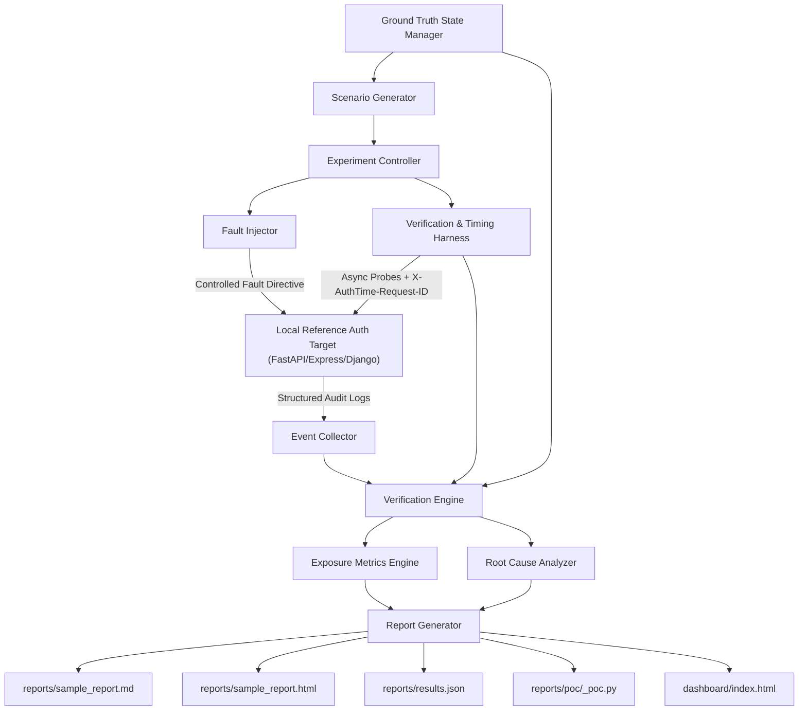

# AuthTime — Temporal Authorization Attack & Verification Engine

[](https://github.com/Saisandeep05/AuthTime/actions)
[](LICENSE)
[](https://www.python.org/)

---

## 🤔 What is AuthTime? (Explained Simply)

Imagine an employee gets fired at **10:00 AM**, and HR immediately revokes their admin account in the company database.

However, because web applications store user permissions in fast temporary memory (caches or JWT tokens) to speed things up, **the application doesn't notice the revocation right away**. For the next 60 seconds, the fired employee can still log in, download sensitive user records, or make admin changes!

**AuthTime** is an open-source security tool that automatically tests web applications to find, measure, and prove this hidden security vulnerability — called the **Authorization Exposure Window**.

```
[10:00:00 AM] HR Revokes Admin Rights in Database ────────┐
                                                         ├── ⚠️ 10-Second Vulnerability Gap (Exposure Window)
[10:00:10 AM] Application Cache Finally Expires ─────────┘
```

---

## ⚡ Headline Discovery

In our reference web application setup:
- **What happened**: An admin user's role was changed to a standard `User`.
- **The flaw**: The application continued accepting admin requests for **60.0 seconds** (or **4.5s ± 1.5s** in accelerated test mode) because the authorization cache was stale.
- **Security Score**: Received a **Severity Score of 6.2 / 10.0 (MEDIUM)**.

---

## 💡 Why Does This Problem Exist?

Modern websites (built with FastAPI, Node.js, Django, React, microservices, or API Gateways) use caching to run fast:

1. **Database**: Updates instantly when access is revoked (`DENY`).
2. **Application Cache / Token**: Stores the user's old role in memory for 30–300 seconds (`ALLOW`).
3. **The Risk**: Until that cache expires, the application trusts the stale memory instead of the database.

AuthTime simulates controlled access revocations and fires high-precision background requests to measure the exact second access is finally blocked.

---

## 🛡️ Safety Boundary & Operating Constraints

> [!CAUTION]
> **Strict Local Loopback Boundary**: AuthTime operates **exclusively** against local reference targets running on `127.0.0.1` or `localhost`.
> - **NO** external network scanning or third-party targets.
> - **NO** real credentials or personal data.
> - **NO** external network traffic.
> - **Fail-Safe Abort**: AuthTime includes hardcoded runtime enforcement that immediately aborts execution if any non-local target URL is supplied.

---

## 📂 Project Directory Structure

AuthTime follows a standard Python **`src/` package layout**:

```
AuthTime/
├── src/                            # Source Packages
│   ├── app/                        # Reference Auth Target Application (FastAPI on 127.0.0.1)
│   │   ├── main.py                 # FastAPI application factory
│   │   ├── config.py               # Settings & secrets
│   │   ├── api/endpoints.py        # Protected routes & /faults/* injection controller
│   │   ├── auth/jwt.py             # PyJWT creation & verification
│   │   ├── cache/ttl_cache.py      # Thread-safe in-memory authorization TTL cache
│   │   └── rbac/roles.py           # Role definitions & RBAC checks
│   │
│   ├── authtime/                   # AuthTime Engine Core
│   │   ├── cli.py                  # CLI entrypoint (authtime)
│   │   ├── controller/experiment.py# Trial controller & statistical aggregator
│   │   ├── events/collector.py     # Audit event collector (X-AuthTime-Request-ID)
│   │   ├── fault_injector/client.py# Loopback fault injection client
│   │   ├── ground_truth/manager.py # Dynamic Ground Truth state manager
│   │   ├── history/tracker.py      # Cross-run exposure history tracker & regression diffing
│   │   ├── models/schemas.py       # Pydantic v2 schemas
│   │   ├── reporting/generator.py  # Markdown, HTML, JSON & runnable PoC generator
│   │   ├── scenarios/generator.py  # Coarse, matrix & cross-user scenario generators
│   │   ├── timing/clock.py         # Monotonic clock & scheduler jitter calibration
│   │   └── verification/           # Exposure calculator, prober & root cause analyzer
│   │
│   └── targets/                    # Multi-Framework Target Replicas
│       └── caep_target.py          # OpenID CAEP/SSF push revocation target
│
├── dashboard/                      # Visual Exposure Timeline Dashboard
│   └── index.html                  # Interactive HTML5/Chart.js visual dashboard
│
├── targets/                        # Additional Framework Reference Targets
│   ├── express/                    # Node.js Express target (server.js, 127.0.0.1:8001)
│   └── django/                     # Django target (app.py, 127.0.0.1:8002)
│
├── docs/                           # Specifications & Research Reports
│   ├── architecture.md             # System architecture & component interfaces
│   ├── severity-scoring.md         # Transparent 0-10 severity formula spec
│   ├── findings-report.md          # Technical security research paper
│   └── DEVELOPMENT_LOG.md          # 16-phase development tracking log
│
├── scripts/                        # Live Demo & Testing Scripts
│   ├── test_live.py                # Python interactive live verification script
│   └── test_live.ps1               # PowerShell native live verification script
│
├── tests/                          # Automated Verification Suite (22 Tests)
│   ├── unit/                       # Unit tests (schemas, app, ground truth, root cause)
│   ├── integration/                # Integration tests (controller, fault injection, reports)
│   ├── scenarios/                  # Scenario tests (cross-user isolation)
│   ├── system/                     # System CLI tests
│   └── property/                   # Property-based randomized fuzzing suite (Hypothesis)
│
├── reports/                        # Auto-generated Output Reports
│   ├── sample_report.md
│   ├── sample_report.html
│   ├── results.json
│   └── poc/                        # Standalone Python PoC scripts
│
├── .github/workflows/ci.yml        # GitHub Actions CI workflow
├── Dockerfile                      # Container build manifest (bound to 127.0.0.1)
├── docker-compose.yml              # Single target compose configuration
├── docker-compose.multi-node.yml   # Multi-replica load-balanced cluster setup
├── pyproject.toml                  # Setuptools package configuration (pythonpath = "src")
├── requirements.txt                # Python dependencies
├── run.py                          # Top-level demonstration launcher
├── test_live.py                    # Root interactive test shortcut
├── test_live.ps1                   # Root PowerShell test shortcut
├── implementation_plan.md          # Detailed engineering & design specification
└── README.md                       # Portfolio overview & documentation
```

---

## 🏗️ System Architecture



---

## 🌟 Key Features & Capabilities

1. **Ground Truth vs. Application Decision Engine**: Compares expected authorization decisions against actual application HTTP responses at exact timestamps.
2. **High-Precision Monotonic Timing**: Uses Python's `time.monotonic()` to eliminate wall-clock drift, automatically measuring harness overhead (`scheduler_jitter_ms`).
3. **Adaptive Binary Search Probing**: Automatically pinpoints exact revocation transition boundaries down to $\le 100\text{ms}$ precision.
4. **Visual Exposure Timeline Dashboard**: Interactive visual timeline dashboard in [`dashboard/index.html`](dashboard/index.html) visualizing status transitions, probe markers, severity badges, and audit log tables.
5. **Cross-Run Regression Tracking**: Records run metrics in `history/exposure_history.jsonl` with `authtime compare` to catch exposure regressions in CI pipelines.
6. **Multi-Framework Targets**: Includes reference targets for FastAPI ([`src/app/`](src/app/)), Node.js Express ([`targets/express/`](targets/express/)), Django ([`targets/django/`](targets/django/)), and OpenID CAEP/SSF push revocation ([`src/targets/caep_target.py`](src/targets/caep_target.py)).
7. **Property-Based Fuzzing Suite**: 100-iteration randomized property fuzzing suite in [`tests/property/test_exposure_fuzzing.py`](tests/property/test_exposure_fuzzing.py) validating timing invariant guarantees.
8. **Transparent Severity Scoring (0–10)**: Auditably scores findings based on exposure duration, endpoint sensitivity weight, and evidence confidence.
9. **Standalone Reproduction Script Generation**: Automatically generates standalone, runnable Python PoC scripts (`reports/poc/<experiment_id>_poc.py`) to independently reproduce findings.
10. **Technical Security Research Paper**: Comprehensive write-up published in [`docs/findings-report.md`](docs/findings-report.md).

---

## 🚀 Quickstart & Usage

### 1. Installation & Environment Setup

```bash
# Clone the repository
git clone https://github.com/Saisandeep05/AuthTime.git
cd AuthTime

# Install dependencies and package in editable mode
pip install -r requirements.txt
pip install -e .
```

### 2. Run Interactive Live Verification (Step-by-Step)

Test AuthTime live in your terminal with real-time feedback:

```bash
# On Windows / Linux / macOS:
python test_live.py

# Or in Windows PowerShell:
.\test_live.ps1
```

### 3. Run Top-Level Demonstration Engine

```bash
python run.py
```
This automatically starts the local reference target, executes 3 experiment trials, and generates formatted reports in `reports/`.

### 4. Open the Visual Exposure Dashboard

Open [`dashboard/index.html`](dashboard/index.html) in any web browser to explore interactive timeline charts, probe markers, severity badges, and audit logs.

### 5. Using the `authtime` CLI

```bash
# Start local reference target server
python -m authtime.cli target start --port 8000

# Execute experiment scenario
python -m authtime.cli run --fault-type stale_cache --repetitions 3 --output-dir reports

# Compare current exposure against historical baseline for regression testing
python -m authtime.cli compare --current-exposure 6.0 --threshold 0.5
```

### 6. Running Docker Environment

```bash
docker compose up --build
```
> Ports are safely bound exclusively to `127.0.0.1:8000`.

---

## 📊 Sample Reports & Findings

Review real generated demonstration output committed in this repository:
- 📄 **Markdown Report**: [`reports/sample_report.md`](reports/sample_report.md)
- 🌐 **HTML Report**: [`reports/sample_report.html`](reports/sample_report.html)
- 🤖 **Machine-Readable JSON**: [`reports/results.json`](reports/results.json)
- 📝 **Technical Research Write-up**: [`docs/findings-report.md`](docs/findings-report.md)

---

## 📐 Technical & Mathematical Specification

For security researchers and engineers, the central metric computed by AuthTime is the **Authorization Exposure Window**:

$$\text{Exposure Window} = [t_{\text{last\_unauth}} - t_{\text{fault}},\, t_{\text{first\_block}} - t_{\text{fault}}]$$

Severity scores are assigned on a transparent scale of $0.0 \dots 10.0$:
$$\text{Severity Score} = \min\left(10.0,\, S_{\text{exposure}} \times W_{\text{endpoint}} \times C_{\text{confidence}}\right)$$

---

## 🚫 What AuthTime Does NOT Do (Limitations & Scope)

To maintain clarity and ethical alignment, AuthTime **does NOT**:
- Scan remote IP addresses, public domain names, or external SaaS endpoints.
- Store or process real-world passwords, API keys, or personally identifiable information (PII).
- Perform brute-force password guessing, fuzzing of unhandled crash conditions, or remote code execution exploits.
- Operate outside local loopback interfaces (`127.0.0.1`).

---

## 🧪 Running the Test Suite

Run the 22-test automated verification and property-based fuzzing suite:

```bash
pytest --verbose
```

---

## 📜 License

This project is licensed under the [MIT License](LICENSE).
