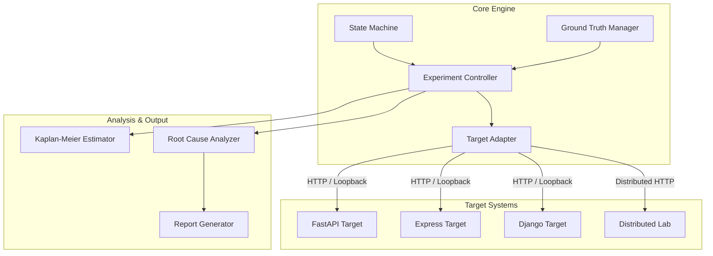

# AuthTime

> **AuthTime measures how long revoked users can continue accessing protected resources in distributed authorization systems.** It serves as an open-source controlled security research harness for experimentally measuring and quantifying Temporal Authorization Exposure Windows ($\Delta t_{\text{exp}}$) during access revocation fault injection.

<p align="center">
  
</p>

<p align="center">
  <a href="https://github.com/Saisandeep05/AuthTime/actions"></a>
  <a href="LICENSE"></a>
  <a href="https://www.python.org/"></a>
  <a href="#safety"></a>
  <a href="#verified-results"></a>
</p>

**Tech Stack**: `Python 3.12` • `FastAPI` • `PostgreSQL` • `Redis` • `Django` • `Express.js` • `OpenID CAEP/SSF` • `JWT` • `HTTPX` • `Pytest` • `Hypothesis` • `Docker`

### Quick Navigation
- [What AuthTime Does](#what-authtime-does)
- [Quick Start](#quick-start)
- [How AuthTime Works](#how-authtime-works)
- [What You Get](#what-you-get)
- [Verified Results](#verified-results)
- [Architecture](#architecture)
- [Advanced Usage](#advanced-usage)
- [Supported Targets](#supported-targets)
- [Repository Structure](#repository-structure)
- [Documentation](#documentation)
- [Safety](#safety)
- [License](#license)

---

## What AuthTime Does

When an administrative user's privileges are revoked in a central database (due to employee offboarding, role demotion, or account suspension), distributed microservices and API gateways often fail to enforce that revocation immediately.

Applications continue accepting unauthorized requests during a silent **Temporal Authorization Exposure Window** ($\Delta t_{\text{exp}}$). This delay is caused by stale worker caches trusting outdated permissions, stateless JWT tokens remaining valid until expiration, or asynchronous message broker propagation lag.

<p align="center">
  
</p>

**AuthTime** provides an empirical, automated research harness that injects controlled revocation faults, executes high-precision HTTP probing ($\le 100\text{ms}$ resolution), measures exact exposure windows, and generates standalone proof-of-concept reproduction scripts.

---

## Quick Start

> **START HERE**: Execute the 4 steps below to run your first experiment.

### 1. Clone & Setup

```bash
git clone https://github.com/Saisandeep05/AuthTime.git
cd AuthTime

pip install -r requirements.txt
pip install -e .
```

### 2. Run Main Demonstration Engine

```bash
python run.py
```

### 3. View Interactive Dashboard & Reports

After running `python run.py`:
- Open `http://127.0.0.1:8000` or [`dashboard/index.html`](dashboard/index.html) in your browser to view interactive timeline charts and audit logs.
- Generated Markdown, HTML, and JSON reports are saved to `reports/examples/`.

### 4. Run Automated Test Suite

```bash
pytest --verbose
```

---

## How AuthTime Works

<p align="center">
  
</p>

> AuthTime establishes a known-good authorization state, triggers a controlled revocation or fault, probes the target while the change propagates, measures the resulting exposure window, and produces evidence for analysis.

### The Workflow

1. **Target** — Connect to the selected authorization system.
2. **Baseline** — Confirm the user is currently authorized.
3. **Revocation/Fault** — Change or revoke authorization and record the event time.
4. **Probe** — Repeatedly send requests while the system propagates the change.
5. **Measure** — Detect when authorization changes from `ALLOW` to `DENY` and calculate the exposure window.
6. **Report** — Store evidence and generate the resulting report.

> **Exposure window:** The time between the authoritative authorization change and the first observed denial of the revoked request.

---

## What You Get

| Capability | Description |
| :--- | :--- |
| **Exposure Measurement** | Quantify temporal lag between access revocation and system-wide enforcement. |
| **Root-Cause Diagnosis** | Identify likely lag causes including stale worker caches, unrevoked JWTs, and propagation delays. |
| **Evidence Generation** | Automatically output auditable JSON telemetry, Markdown reports, HTML charts, and runnable Python PoCs. |
| **Mitigation Comparison** | Evaluate and compare authorization versioning strategies against vulnerable baselines. |
| **Distributed Validation** | Validate authorization propagation behavior across multi-replica services in a controlled environment. |

---

## Verified Results

All AuthTime measurements are backed by reproducible empirical execution:

- **Level C Infrastructure Validation**: Validated in a controlled Docker environment using PostgreSQL 16, Redis 7, and three independent API replicas. See [`docs/distributed-validation-results.md`](docs/distributed-validation-results.md).
- **Employee Offboarding Case Study**: Modeled an enterprise offboarding failure (`Finance Admin` demotion). Under the vulnerable baseline, Replica API-3 allowed access for **`3.96s`** post-revocation. Under Authorization Versioning mitigation, no post-revocation ALLOW was observed within the configured 100 ms measurement resolution (**100.0% exposure reduction**). See [`docs/real-world-case-study.md`](docs/real-world-case-study.md).

| Experiment State | Max Exposure ($\Delta t_{\text{exp}}$) | Mean Replica Exposure | Engineering Outcome |
| :--- | :---: | :---: | :--- |
| **Vulnerable Baseline (5 Runs)** | `3.96s` (Std Dev: 0.28s) | `3.96s` | Stale cache exposure on Replica API-3 |
| **Mitigated State (5 Runs)** | **`0.00s`** | **`0.00s`** | **No ALLOW observed @ 100ms resolution** |

- **Mitigation Performance Benchmark**: Version-aware cache validation adds only **0.42 ms** average latency overhead per request while preserving sub-millisecond cache hits. See [`docs/mitigation-tradeoff-report.md`](docs/mitigation-tradeoff-report.md).
- **Test Suite Verification**: **85 passed, 4 skipped** across unit, integration, property fuzzing, and system test suites (`pytest --verbose`).

---

## Architecture

AuthTime uses a modular architecture where the core measurement engine interacts with target systems through a standardized Target Adapter interface.

<p align="center">
  
</p>



> For full component specifications and interface contracts, see [`docs/architecture.md`](docs/architecture.md).

---

## Advanced Usage

> *The workflows below are optional and not required for basic AuthTime usage.*

### 1. Using the `authtime` CLI

For users who require command-line control or CI integration:

```bash
# Start reference target application
authtime target start --port 8000

# Execute experiment scenario
authtime run --fault-type stale_cache --repetitions 3 --output-dir reports/examples

# Compare exposure against baseline threshold
authtime compare --current-exposure 6.0 --threshold 0.5
```

### 2. Distributed Authorization Laboratory

AuthTime includes a **Distributed Authorization Validation Laboratory** (`targets/distributed_lab/`) to validate multi-replica propagation:

```bash
docker compose -f docker-compose.lab.yml up --build
```
This spins up a controlled Docker environment with PostgreSQL 16, Redis 7, and three independent API replicas (`API-1`, `API-2`, `API-3` on ports `8010`, `8011`, `8012`) to test multi-process invalidation propagation.

### 3. Real-World Case Study Execution

To execute the enterprise offboarding scenario:

```bash
python run.py --case-study
```
Simulates employee demotion and compares vulnerable stale cache behavior against version-aware cache mitigation across multiple trial runs.

### 4. Advanced Validation & Stress Testing Tools

Standalone tools located in `scripts/`:
- **Load Testing**: `python scripts/run_load_test.py --concurrency 50`
- **Endurance Testing**: `python scripts/run_endurance_test.py --duration 30`
- **Mitigation Benchmarking**: `python scripts/benchmark_mitigation.py`

---

## Supported Targets

| Target | Mode | Status |
| :--- | :--- | :---: |
| **FastAPI Reference** | Python 3.12 (ASGI) | ✅ Primary Reference |
| **Distributed Lab** | Postgres + Redis + 3 Replicas | ✅ Tested E2E |
| **Express.js** | Node.js 18+ (HTTP) | ✅ Tested E2E |
| **Django Native** | Python 3.12 (WSGI) | ✅ Tested E2E |
| **OpenID CAEP / SSF** | Cryptographic SSF (HMAC/RS256) | ✅ Tested E2E |

---

## Repository Structure

```text
src/           Core AuthTime measurement engine & reference FastAPI app
targets/       Target framework replicas and Level C distributed lab
tests/         Automated test suite (unit, integration, property fuzzing, system)
experiments/   Empirical experiment evidence JSON artifacts
docs/          Technical specifications, research write-ups, and methodology
dashboard/     Interactive HTML5 visual exposure timeline dashboard
scripts/       Advanced validation tools (load testing, endurance, benchmarking)
reports/       Sample audit reports (Markdown, HTML, JSON) and runnable Python PoCs
```

---

## Documentation

For technical deep dives, consult the dedicated documentation:

- 🏗️ [**Architecture Specification**](docs/architecture.md) — Component contracts & design specifications
- 🔬 [**Security Research Write-up**](docs/findings-report.md) — Technical research on authorization revocation gaps
- 🧪 [**Distributed Validation Results**](docs/distributed-validation-results.md) — Empirical evidence & Level C metrics
- 💼 [**Offboarding Case Study**](docs/real-world-case-study.md) — End-to-end offboarding failure analysis & mitigation
- 📊 [**Mitigation Benchmark Report**](docs/mitigation-tradeoff-report.md) — Performance overhead & latency tradeoffs
- 📐 [**Severity Scoring Formula**](docs/severity-scoring.md) — Transparent 0-10 severity score formula
- 🌐 [**Engineering Methodology**](docs/engineering-methodology.md) — Architecture & testing principles

---

## Safety

**Strict Local Loopback Boundary**: AuthTime operates **exclusively** against local reference targets running on `127.0.0.1` or `localhost`.
- No external network scanning or third-party targets.
- No real credentials or personal data used.
- Hardcoded runtime enforcement (`validate_and_resolve_loopback`) immediately aborts execution if a non-loopback URL is supplied.

---

## License

This project is licensed under the [MIT License](LICENSE).
