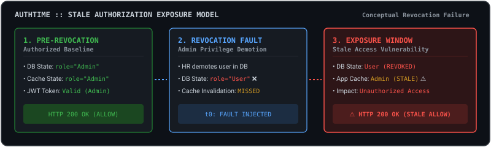
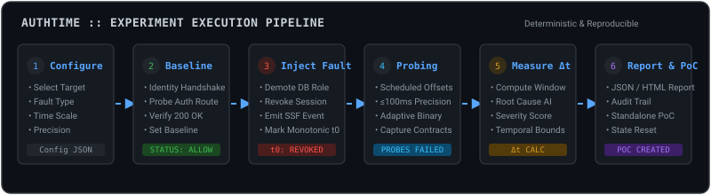
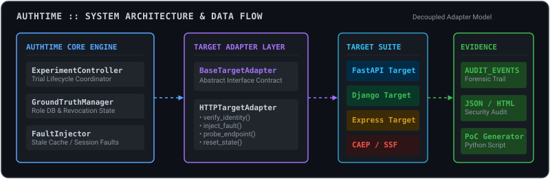
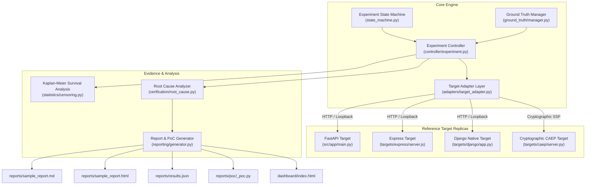

# AuthTime

> **An open-source controlled security research harness for experimentally measuring and quantifying Temporal Authorization Exposure Windows ($\Delta t_{\text{exp}}$) during access revocation fault injection.**

<p align="center">
  
</p>

<p align="center">
  <a href="https://github.com/Saisandeep05/AuthTime/actions"></a>
  <a href="LICENSE"></a>
  <a href="https://www.python.org/"></a>
  <a href="#-safety-boundary--constraints"></a>
  <a href="#-verified-project-status"></a>
</p>

**Tech Stack**: `Python 3.12` • `FastAPI` • `Django` • `Express.js` • `OpenID CAEP/SSF` • `JWT` • `HTTPX` • `Pytest` • `Hypothesis` • `Docker`

---

## 🎯 The Security Exposure Problem

When an administrative user's privileges are revoked in a primary database (due to employee termination, role demotion, or security compromise), distributed microservices and web applications often **fail to immediately enforce revocation**. 

Applications continue accepting unauthorized requests during a silent **Temporal Authorization Exposure Window** ($\Delta t_{\text{exp}}$) caused by:
1. **Stale In-Memory Caches**: Application workers caching user permissions until a local TTL expires.
2. **Unrevoked Stateless JWT Tokens**: Valid cryptographic signatures accepted until token expiration (`exp`).
3. **Asynchronous Propagation Delays**: Back-channel revocation events failing or delayed across message brokers.

<p align="center">
  
</p>

**AuthTime** provides an empirical, automated research harness to inject controlled revocation faults, execute high-precision HTTP probing ($\le 100\text{ms}$ resolution), measure exact exposure windows, and generate standalone proof-of-concept reproduction scripts.

---

## ⚡ Headline Discovery

In our reference web application benchmark setup:

- **What Happened**: An admin user's role was demoted to a standard `User` in the primary ground-truth database.
- **The Vulnerability**: The application continued executing privileged admin requests for **60.0 seconds** of configured TTL (or **4.52s ± 0.05s** in accelerated 0.1x experimental mode) because the worker authorization cache was stale.
- **Severity Score**: Assigned a **Severity Score of 7.3 / 10.0 (HIGH)** per the auditable formula in [`docs/severity-scoring.md`](docs/severity-scoring.md).
- **Root Cause**: `AUTHORIZATION_CACHE` (Stale in-memory cache trusting outdated role claims post-revocation).

```
[10:00:00 AM] HR Revokes Admin Rights in Database ────────┐
                                                         ├── ⚠️ 60.0-Second Vulnerability Gap (60.0s Configured TTL at 1.0x Real-Time)
[10:01:00 AM] Application Cache Finally Expires ─────────┘
```
*(Note: In 0.1x accelerated experimental mode, the 60.0s TTL window completes in 4.52s ± 0.05s of wall-clock time).*

---

## ✅ Verified Project Status

- **58 Automated Tests Passing (58 passed, 1 skipped cleanly)** across unit, integration, property fuzzing, and system CLI test suites.
- **Target Adapter Abstraction Layer** (`BaseTargetAdapter` / `HTTPTargetAdapter`) decoupling measurement orchestration from target web frameworks.
- **Cryptographically Hardened SSF/CAEP Implementation** (HMAC-SHA256 & RS256 token verification, `jti` replay resistance with 300s TTL eviction).
- **Forensic Audit Log Preservation** (`AUDIT_EVENTS` preserved across state reset cycles).
- **Strict Local Loopback Boundary** (Hardcoded runtime enforcement restricting execution exclusively to `127.0.0.1` / `localhost`).

---

## 🔄 Visual Experiment Lifecycle

AuthTime coordinates a multi-stage experimental pipeline to measure access revocation lag with high precision:

<p align="center">
  
</p>

1. **Configure Target**: Select reference target application (FastAPI, Node.js Express, Django, or OpenID CAEP/SSF).
2. **Establish Baseline**: Perform identity verification and validate pre-fault authorized access (`ALLOW`).
3. **Inject Controlled Fault**: Demote user role or revoke session in database/control plane.
4. **Execute High-Precision Probes**: Fire background HTTP probes at scheduled offsets ($\le 100\text{ms}$ schedule resolution) using `time.monotonic()`.
5. **Collect Evidence & Analyze**: Evaluate response contracts, compute exposure window $[t_{\text{last\_unauth}}, t_{\text{first\_block}}]$, determine root cause, and generate runnable PoC scripts.
6. **Generate Reports & Reset State**: Output formatted JSON, HTML, and standalone Python PoC reproduction scripts, resetting target state while preserving immutable forensic audit trails.

---

## 🏗️ System Architecture

AuthTime uses a modular, decoupled architecture where the core measurement engine communicates with target applications exclusively through a standardized **Target Adapter Abstraction Layer**:

<p align="center">
  
</p>



---

## 💻 Supported Target Frameworks

| Target Framework | Implementation Path | Execution Mode | Adapter Interface | Status |
| :--- | :--- | :--- | :--- | :---: |
| **FastAPI** | `src/app/main.py` | Python 3.12 (ASGI) | `HTTPTargetAdapter` | ✅ Primary Tested |
| **Node.js Express** | `targets/express/server.js` | Node.js 18+ (HTTP) | `HTTPTargetAdapter` | ✅ Tested E2E |
| **Django Native** | `targets/django/app.py` | Python 3.12 (WSGI) | `HTTPTargetAdapter` | ✅ Tested (Optional Req) |
| **OpenID CAEP / SSF** | `targets/caep/server.py` | Cryptographic SSF | `HTTPTargetAdapter` | ✅ Tested (HMAC/RS256) |

---

## 📂 Directory Structure

```
AuthTime/
├── assets/                         # Visual Assets & Animations
│   ├── animations/                 # SVG Animated Visualizations
│   │   ├── authtime-exposure-window.svg
│   │   ├── experiment-lifecycle.svg
│   │   └── architecture-flow.svg
│   └── diagrams/                   # Conceptual Visual Diagrams
│       └── authorization-exposure-model.svg
│
├── src/                            # Source Packages
│   ├── app/                        # Reference Auth Target Application (FastAPI on 127.0.0.1:8000)
│   │   ├── main.py                 # FastAPI application factory
│   │   ├── config.py               # Settings & secrets
│   │   ├── api/endpoints.py        # Protected routes & /faults/* injection controller
│   │   ├── auth/jwt.py             # PyJWT creation & verification
│   │   ├── cache/ttl_cache.py      # Thread-safe in-memory authorization TTL cache
│   │   └── rbac/roles.py           # Role definitions & RBAC checks
│   │
│   └── authtime/                   # AuthTime Core Engine
│       ├── adapters/               # Target Adapter Abstraction (target_adapter.py, contract.py)
│       ├── cli.py                  # CLI entrypoint (authtime)
│       ├── controller/             # Trial controller & statistical aggregator (experiment.py)
│       ├── events/                 # Audit event collector (collector.py)
│       ├── fault_injector/         # Loopback fault injection client (client.py)
│       ├── ground_truth/           # Dynamic Ground Truth state manager (manager.py)
│       ├── history/                # Exposure history tracker & regression diffing (tracker.py)
│       ├── lifecycle/              # State machine & transition invariants (state_machine.py)
│       ├── models/                 # Pydantic v2 schemas & evidence models
│       ├── network/                # DNS-rebinding loopback safety (safety.py)
│       ├── reporting/              # Markdown, HTML, JSON & runnable PoC generator (generator.py)
│       ├── scenarios/              # Coarse, matrix & cross-user scenario generators
│       ├── statistics/             # Kaplan-Meier survival estimator & censoring analysis
│       ├── timing/                 # Monotonic clock & scheduler jitter calibration (clock.py)
│       └── verification/           # Exposure calculator, prober & root cause analyzer
│
├── targets/                        # Multi-Framework Target Replicas
│   ├── caep/                       # OpenID CAEP/SSF push revocation target (server.py)
│   ├── express/                    # Node.js Express target (server.js, 127.0.0.1:8001)
│   └── django/                     # Django native target (app.py, 127.0.0.1:8002)
│
├── dashboard/                      # Visual Exposure Timeline Dashboard
│   └── index.html                  # Interactive HTML5/Chart.js visual dashboard
│
├── docs/                           # Specifications & Research Write-ups
│   ├── architecture.md             # System architecture & component interface spec
│   ├── severity-scoring.md         # Transparent 0-10 severity formula spec
│   └── findings-report.md          # Technical security research write-up
│
├── tests/                          # Automated Verification Suite (59 Tests)
│   ├── unit/                       # Unit tests (schemas, adapters, ground truth, root cause)
│   ├── integration/                # Integration tests (controller, fault injection, multi-framework)
│   ├── scenarios/                  # Scenario tests (cross-user isolation)
│   ├── system/                     # System CLI tests
│   └── property/                   # Property-based randomized fuzzing suite (Hypothesis)
│
├── reports/                        # Auto-generated Output Reports & PoCs
│   ├── sample_report.md
│   ├── sample_report.html
│   ├── results.json
│   └── poc/                        # Standalone Python PoC scripts
│
├── Dockerfile                      # Container build manifest (bound to 127.0.0.1)
├── docker-compose.yml              # Single target compose configuration
├── pyproject.toml                  # Setuptools package configuration
├── requirements.txt                # Python dependencies
├── run.py                          # Top-level demonstration launcher
└── README.md                       # Portfolio overview & documentation
```

---

## 🚀 Quickstart

### 1. Installation

```bash
# Clone the repository
git clone https://github.com/Saisandeep05/AuthTime.git
cd AuthTime

# Install dependencies and package in editable mode
pip install -r requirements.txt
pip install -e .
```

### 2. Run Interactive Live Verification

```bash
# On Windows / Linux / macOS:
python test_live.py

# Or in Windows PowerShell:
.\test_live.ps1
```

### 3. Run Top-Level Demonstration Engine

```bash
python run.py
```
This automatically starts the local reference target, executes experiment trials, and generates formatted reports in `reports/`.

### 4. Execute Full Automated Test Suite

```bash
pytest --verbose
```

### 5. Open Visual Exposure Dashboard

Open [`dashboard/index.html`](dashboard/index.html) in any web browser to view interactive timeline charts, probe markers, severity badges, and audit logs.

### 6. Using the `authtime` CLI

```bash
# Start local reference target server
python -m authtime.cli target start --port 8000

# Execute experiment scenario
python -m authtime.cli run --fault-type stale_cache --repetitions 3 --output-dir reports

# Compare current exposure against historical baseline for regression testing
python -m authtime.cli compare --current-exposure 6.0 --threshold 0.5
```

---

## 🛠️ Key Engineering Highlights

- **Target Adapter Abstraction**: Modular `BaseTargetAdapter` interface standardizing identity verification, fault injection, probe execution, state resets, and audit event collection across web frameworks.
- **High-Precision Monotonic Timing**: Leverages `time.monotonic()` to eliminate wall-clock drift, automatically measuring scheduler jitter and harness overhead.
- **Adaptive Binary Search Probing**: Pinpoints exact revocation transition boundaries down to $\le 100\text{ms}$ precision.
- **Cryptographic SSF/CAEP Security**: Implements OpenID CAEP/SSF event reception with HMAC-SHA256/RS256 token verification and `jti` replay resistance with 300s TTL eviction.
- **Forensic Audit Log Preservation**: State resets restore authorization roles and caches while leaving immutable audit logs (`AUDIT_EVENTS`) intact for forensic auditing.
- **Property-Based Fuzzing Suite**: 100-iteration randomized property testing with Hypothesis validating timing invariant guarantees.
- **Standalone PoC Generation**: Automatically outputs zero-dependency, executable Python reproduction scripts (`reports/poc/<exp>_poc.py`).

---

## 🛡️ Safety Boundary & Constraints

> [!CAUTION]
> **Strict Local Loopback Boundary**: AuthTime operates **exclusively** against local reference targets running on `127.0.0.1` or `localhost`.
> - **NO** external network scanning or third-party targets.
> - **NO** real credentials or personal data.
> - **NO** external network traffic.
> - **Fail-Safe Abort**: AuthTime includes hardcoded runtime enforcement (`validate_and_resolve_loopback`) that immediately aborts execution if a non-loopback URL is supplied.

---

## 📜 License

This project is licensed under the [MIT License](LICENSE).
