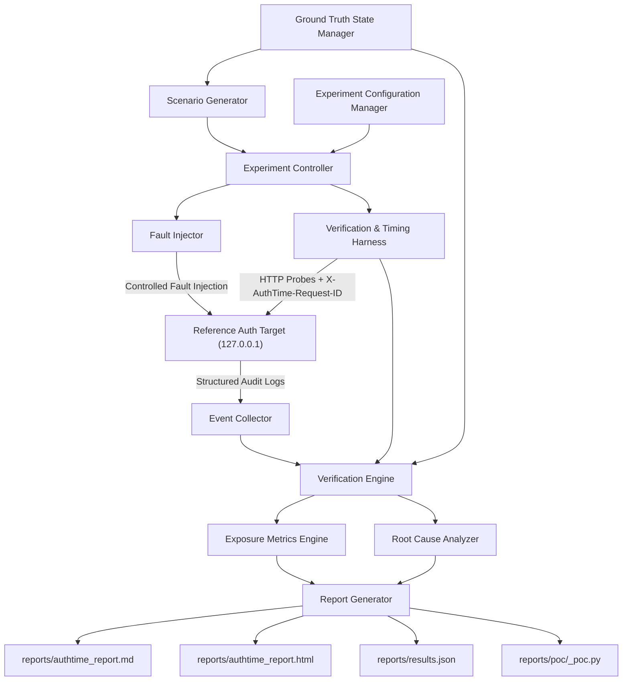

# AuthTime — System Architecture & Component Specifications

AuthTime is a local, software-only cybersecurity testing framework designed to experimentally measure the **Authorization Exposure Window**:
> The time interval between authorization revocation and when unauthorized access is reliably blocked by a reference application.

---

## 1. Safety Boundary & Operating Constraints

- Target URLs are strictly constrained to `http://127.0.0.1:8000` or `http://localhost:8000`.
- Hardcoded runtime safety check refuses any non-local destination.
- Fault-injection endpoints (`POST /faults/inject`, `POST /faults/reset`) bind strictly to `127.0.0.1` and fail-safe if non-local exposure is configured.

---

## 2. Component Specifications

### 2.1 Reference Auth Target (`app/`)
- **Framework**: FastAPI + Uvicorn.
- **Authentication**: PyJWT token creation & validation.
- **RBAC**: Custom middleware supporting `Admin`, `User`, `Guest`, and `ServiceAccount` roles.
- **Cache**: Thread-safe in-memory TTL authorization cache (`app/cache/ttl_cache.py`).
- **Protected Routes**:
  - `GET /invoices/{id}` (User & Admin access)
  - `GET /admin/users` (Admin access only)
- **Fault Injection API**:
  - `POST /faults/inject` (`role_revocation`, `token_expiry`, `stale_cache`, `agent_session_revocation`)
  - `POST /faults/reset`
- **Structured Audit Logging**: Emits JSON log entries correlated by `X-AuthTime-Request-ID`.

### 2.2 Ground Truth State Manager (`authtime/ground_truth/manager.py`)
- Maintains expected authorization state ($\mathcal{GT}$) for every user/role at timestamp $T$.
- Evaluates expected decision (`ALLOW` vs. `DENY`) for comparison against application responses ($\mathcal{AD}$).

### 2.3 Verification & Timing Harness (`authtime/verification/harness.py`)
- Fires async HTTP probes with monotonic clock timestamps (`time.monotonic()`) and human-readable UTC wall-clock timestamps.
- Conducts 20-probe pre-flight calibration burst to measure harness scheduling jitter (`scheduler_jitter_ms`).
- Drives Adaptive Binary Search Probing to narrow transition boundaries down to $\le 100\text{ms}$ target precision.

### 2.4 Scenario Generator (`authtime/scenarios/generator.py`)
- Generates coarse offset schedules (`+0s`, `+1s`, `+5s`, `+30s`, `+60s`).
- Supports multi-parameter matrix schedules ($JWT\_TTL \times Cache\_TTL$).
- Supports `cross_user_isolation` scenarios (User A vs. User B).
- Supports holistic time-scaling (`time_scale.factor`).

### 2.5 Root Cause Analyzer (`authtime/verification/root_cause.py`)
Classifies evidence into taxonomies:
- `TOKEN_EXPIRY`
- `AUTHORIZATION_CACHE`
- `CACHE_KEY_COLLISION`
- `DELEGATED_CREDENTIAL_STALENESS`
- `ROLE_REVOCATION`
- `PERMISSION_REVOCATION`
- `SESSION_STATE`
- `RACE_CONDITION`
- `PROPAGATION_DELAY`
- `UNKNOWN`

### 2.6 Report Generator (`authtime/reporting/generator.py` & `poc_generator.py`)
- Produces `reports/authtime_report.md`, `reports/authtime_report.html`, `reports/results.json`, and standalone Python PoC scripts (`reports/poc/`).
- Includes generic real-world calibration mapping and transparent severity scores (0–10).

---

## 3. Data Flow

