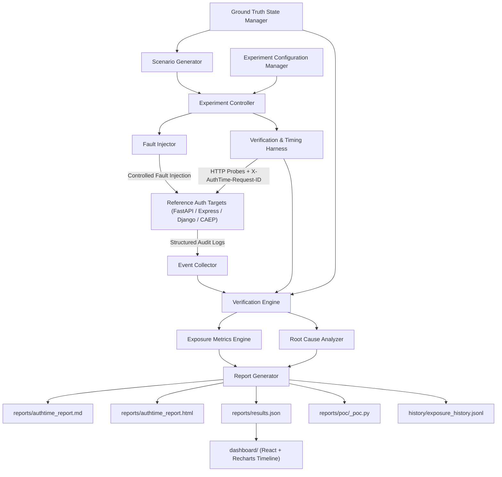
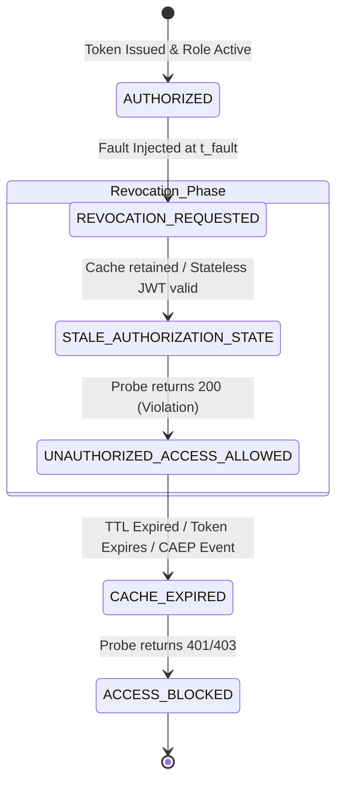

# AuthTime — Temporal Authorization Attack & Verification Engine

AuthTime is a local, software-only cybersecurity testing framework designed to experimentally measure the temporal gap between intended authorization state (Ground Truth) and actual application authorization behavior over time.

The central metric is the **Authorization Exposure Window**:
> "After authorization is revoked, how long does the reference application continue allowing access that should now be denied?"

---

## 1. Safety Boundary & Operating Constraints

> [!CAUTION]
> **Strict Local Testing Boundary**: AuthTime operates **exclusively** against our local, deliberately vulnerable reference application running on `127.0.0.1`.
> - **NO** external scanning or third-party targets.
> - **NO** real credentials or personal data.
> - **NO** external network traffic.
> The framework includes a hardcoded runtime safety check that immediately aborts execution if any target URL outside `127.0.0.1` or `localhost` is configured.

### Fault-Injection Endpoint Security Controls
1. **Test-Only Administrative Interfaces**: Fault-injection endpoints (`POST /faults/inject`, `POST /faults/reset`) are strictly test-only administrative interfaces.
2. **Local Environment Only**: Available exclusively in local development and testing environments.
3. **Local Loopback Binding**: Must bind exclusively to the local reference application interface (`127.0.0.1`).
4. **No External Exposure**: Must NOT be exposed to external network interfaces.
5. **Docker Local Isolation**: Docker configuration (`docker-compose.yml`, `Dockerfile`) MUST NOT expose fault-injection ports beyond the local host (`127.0.0.1:8000`).
6. **Disabled Outside Test Mode**: Disabled or unavailable whenever the application is run outside the intended local test configuration.
7. **Fail-Safe Abort**: The reference target and testing engine must fail safely (aborting execution) if any configuration attempts to expose fault-injection functionality to a non-local interface or target.
8. **Scope Limitation**: Fault injection functionality remains strictly limited to the local AuthTime reference application.

---

## 2. System Architecture & Data Flow



### Component Responsibilities & Interfaces

| Component | Responsibility | Primary Interface / Methods |
| :--- | :--- | :--- |
| **Reference Auth Target** | Deliberately vulnerable FastAPI (and optional Express/Django/CAEP) target app with JWT, custom RBAC, and configurable in-memory TTL auth cache. | `POST /auth/login`, `GET /invoices/{id}`, `GET /admin/users`, `POST /faults/inject` |
| **Ground Truth State Manager** | Defines expected authorization state (`ALLOW`/`DENY`) for any user, role, and permission at any given timestamp $T$. | `get_expected_state(user, resource, timestamp) -> GroundTruthState` |
| **Experiment Controller** | Orchestrates baseline checks, fault injection, probe scheduling, repeated trial loops, and result compilation. | `run_experiment(config: ExperimentConfig) -> ExperimentResult` |
| **Fault Injector** | Issues controlled fault directives (`token_expiry`, `role_revocation`, `stale_cache`, `agent_session_revocation`) to target app via HTTP. | `inject_fault(fault_type: FaultType, params: dict) -> FaultResponse` |
| **Scenario Generator** | Generates systematic probe schedules incorporating coarse offsets (`+0s`, `+1s`, `+5s`, `+30s`, `+60s`), cross-user isolation scenarios, matrix sweeps, and agent session delegation. | `generate_scenario(fault: FaultType, offsets: list[float]) -> Scenario` |
| **Verification & Timing Harness** | Fires async HTTP probes with `X-AuthTime-Request-ID`, records `monotonic_timestamp` and `UTC_timestamp`, node IDs, and measures latencies & scheduler jitter. | `execute_probe(probe_spec) -> ProbeResult` |
| **Event Collector** | Collects structured event logs emitted by the target app and correlates them using `X-AuthTime-Request-ID`. | `fetch_events(experiment_id: str) -> list[EvidenceEvent]` |
| **Verification Engine** | Compares Ground Truth vs. Application Decision to flag violations, drive Adaptive Probing, and compute exposure windows. | `verify_results(ground_truth, probe_results, events) -> VerificationResult` |
| **Root Cause Analyzer** | Evaluates timing and event evidence to assign evidence-backed root cause classifications (including `CACHE_KEY_COLLISION`, `DELEGATED_CREDENTIAL_STALENESS`). | `analyze_root_cause(results, config) -> RootCauseFinding` |
| **Report Generator** | Renders Markdown (`.md`), HTML (`.html`), real-world calibration notes, machine-readable JSON (`.json`), transparent severity scores (0-10), and standalone PoC scripts (`reports/poc/`). | `generate_reports(experiment_result) -> ReportPaths` |

---

## 3. Core Conceptual Models & Metrics

### 3.1 Ground Truth vs. Application Decision Model

For every probe request $i$, AuthTime compares:
- **Ground Truth ($\mathcal{GT}_i$)**: The expected decision (`DENY` post-revocation, `ALLOW` pre-revocation).
- **Actual Application Decision ($\mathcal{AD}_i$)**: The HTTP status and access permission returned by the reference target (`200 ALLOW` vs. `403/401 DENY`).

$$\text{Result}_i = \begin{cases} \text{VALID\_ACCESS}, & \mathcal{GT}_i = \text{ALLOW} \land \mathcal{AD}_i = \text{ALLOW} \\ \text{EXPECTED\_BLOCK}, & \mathcal{GT}_i = \text{DENY} \land \mathcal{AD}_i = \text{DENY} \\ \text{AUTHORIZATION\_VIOLATION}, & \mathcal{GT}_i = \text{DENY} \land \mathcal{AD}_i = \text{ALLOW} \end{cases}$$

### 3.2 Authorization State Machine



### 3.3 Temporal Measurement, Overhead Disclosure & Exposure Calculations

To eliminate wall-clock clock drift, all duration and interval calculations use Python's monotonic clock (`time.monotonic()`). UTC wall-clock timestamps (`datetime.now(timezone.utc)`) are recorded alongside for forensic human readability.

#### Measurement Overhead Disclosure (Harness Calibration)
Before each experiment run, AuthTime measures and records its own scheduling overhead:
- Executes a short calibration burst (20 no-op probes) prior to experiment launch.
- Measures the deviation between a probe's *intended* fire time and its *actual* monotonic fire time.
- Records the result as `scheduler_jitter_ms` in every `ExperimentResult` and `SecurityFinding`.
- **Jitter Warning Rule**: If `scheduler_jitter_ms` exceeds the configured adaptive-probing `target_ms` (e.g. $> 100\text{ms}$), the report flags the result with a warning:
  > `"Measurement precision may be limited by scheduler overhead, not target-system behavior."`

#### Primary Timing Metrics & Formulas
- **Revocation Timestamp ($t_{\text{fault}}$)**: Monotonic timestamp when authorization revocation was executed.
- **First Observed Unauthorized Access ($t_{\text{first\_unauth}}$)**: Monotonic timestamp of the first probe post-revocation that returned `ALLOW`.
- **Last Observed Unauthorized Access ($t_{\text{last\_unauth}}$)**: Monotonic timestamp of the final probe that returned `ALLOW`.
- **First Reliably Blocked Access ($t_{\text{first\_block}}$)**: Monotonic timestamp of the first probe that returned `BLOCK`.

#### Mathematical Calculations
1. **Exposure Interval**:
   $$[\text{Exposure}_{\min},\, \text{Exposure}_{\max}] = [t_{\text{last\_unauth}} - t_{\text{fault}},\, t_{\text{first\_block}} - t_{\text{fault}}]$$
2. **Estimated Transition Time ($\text{estimated\_exposure}$)**:
   $$\text{estimated\_exposure} = \frac{(t_{\text{last\_unauth}} - t_{\text{fault}}) + (t_{\text{first\_block}} - t_{\text{fault}})}{2}$$
3. **Measurement Precision ($\text{precision}$)**:
   $$\text{precision} = \frac{t_{\text{first\_block}} - t_{\text{last\_unauth}}}{2}$$

> [!IMPORTANT]
> **Reporting Rule**: The report **MUST** clearly distinguish:
> 1. First observed unauthorized access ($t_{\text{first\_unauth}}$)
> 2. Last observed unauthorized access ($t_{\text{last\_unauth}}$)
> 3. First observed blocked access ($t_{\text{first\_block}}$)
> 4. Exposure interval $[t_{\text{last\_unauth}} - t_{\text{fault}},\, t_{\text{first\_block}} - t_{\text{fault}}]$
> 5. Estimated transition time ($\text{estimated\_exposure}$)
> 6. Measurement precision ($\pm \text{precision}$)
> 7. Harness scheduler jitter (`scheduler_jitter_ms`)
> 
> Estimated transitions are **NEVER** presented as exact facts without displaying the measurement precision $\pm \text{precision}$.

#### Coarse Probing vs. Adaptive Probing
- **Coarse Probing**: Probes fired at fixed default offsets: $+0\text{s}$, $+1\text{s}$, $+5\text{s}$, $+30\text{s}$, $+60\text{s}$.
- **Adaptive Probing**: When a transition from `ALLOW` at $t_{\text{last\_unauth}}$ to `BLOCK` at $t_{\text{first\_block}}$ is observed, the Verification Engine executes a binary search probing pattern between $[t_{\text{last\_unauth}}, t_{\text{first\_block}}]$ until the target precision (e.g. $\text{target\_ms} = 100\text{ms}$) is achieved.

### 3.4 Holistic Time Scaling Architecture

When `time_scale.enabled` is set to `true`, **ALL** temporal parameters participating in the experiment are scaled by the exact same scale factor (`time_scale.factor`).

This includes:
- Probe schedule offsets
- JWT TTL
- Authorization cache TTL
- Configured fault delays
- Simulated propagation delays
- Any other experiment-controlled temporal value

Example: With `time_scale.factor = 0.1`, a $60\text{s}$ cache TTL becomes $6.0\text{s}$, a $300\text{s}$ JWT TTL becomes $30.0\text{s}$, and a $+5\text{s}$ probe offset fires at $+0.5\text{s}$.

> [!CAUTION]
> **Time Scale Consistency Rule**: To prevent misleading experimental artifacts, the engine strictly enforces that a scaled probe schedule NEVER interacts with unscaled JWT or cache TTLs. All temporal parameters scale uniformly together.
> 
> The report MUST record:
> 1. Whether time scaling was enabled
> 2. Time scale factor
> 3. Original configured temporal values
> 4. Effective test values

### 3.5 Root-Cause Classification Hierarchy

| Root Cause Code | Trigger Criteria & Evidence | Confidence Statement |
| :--- | :--- | :--- |
| `TOKEN_EXPIRY` | Exposure duration matches remaining JWT lifetime (`exp`); cache was empty/bypassed. | "High: Access persisted strictly until stateless JWT expiration." |
| `AUTHORIZATION_CACHE` | Revocation succeeded in DB, but exposure duration matches configured `cache_ttl`. | "Likely: Authorization cache retained stale role/permissions." |
| `CACHE_KEY_COLLISION` | Revoking User A's authorization altered or permitted User B's access, indicating a cache keying flaw. | "High: Revoking User A's authorization impacted User B's decision, revealing a cache key collision or state bleed." |
| `DELEGATED_CREDENTIAL_STALENESS` | Delegating human's role was revoked, but delegated AI agent token continued operating until natural expiration. | "High: Revoking delegator permission did not invalidate down-scope delegated agent session credential." |
| `ROLE_REVOCATION` | Role change occurred, but application logic failed to evaluate updated role permissions. | "Likely: Middleware failed to check updated role definitions." |
| `PERMISSION_REVOCATION` | Specific permission removed, but endpoint check evaluated stale permission set. | "Likely: Endpoint evaluated legacy permission flag." |
| `SESSION_STATE` | In-memory session state persisted across revocation request. | "Likely: Stateful session was not invalidated on revocation." |
| `RACE_CONDITION` | In-flight request initiated prior to $t_{\text{fault}}$ completed with `200` post-$t_{\text{fault}}$. | "High: Concurrent execution allowed in-flight request completion." |
| `PROPAGATION_DELAY` | Event propagation across internal handlers or multi-node replicas exhibited async delay. | "Likely: Async internal event bus or multi-replica propagation latency." |
| `UNKNOWN` | Anomaly observed that does not fit standard patterns. | "Undetermined: Observed behavior requires manual inspection." |

---

## 4. Experimentation, Matrix System & Statistical Analysis

### 4.1 Experiment Matrix & Special Scenarios
AuthTime supports multi-parameter matrix experiments:
$$\text{Matrix} = \text{JWT\_TTL\_List} \times \text{Cache\_TTL\_List} \times \text{Fault\_Types}$$

#### Special Scenarios
1. **Cross-User Isolation (`cross_user_isolation`)**: Provisions User A (Admin) and User B (User), revokes User A, and verifies User B remains completely unaffected.
2. **AI Agent / NHI Session Revocation (`agent_session_revocation`)**: Tests delegated credentials where delegator permission is revoked mid-task to measure `DELEGATED_CREDENTIAL_STALENESS`.

### 4.2 Repeated Trials & Statistical Reporting
For repeated trial runs ($N$ trials), AuthTime records metrics per trial and computes descriptive statistics:
- Minimum ($\min$)
- Maximum ($\max$)
- Mean ($\mu$)
- Median ($\tilde{x}$)
- Standard Deviation ($\sigma$)
- 95th Percentile ($P_{95}$)

These statistics describe repeatability, trial-to-trial variability, distribution of measured exposure, and consistency between runs.

> [!NOTE]
> **Sample Size Reporting Standard**: If $N < 5$, the report **MUST** explicitly identify the result as a limited-sample observation and **MUST** avoid inferential statistical claims. Neither $N=5$ nor $N=10$ automatically establishes inferential statistical significance.

### 4.3 Experiment Configuration Schema (`ExperimentConfig`)
```yaml
experiment_id: "EXP-2026-08-22-001"
description: "Matrix evaluation of stale cache vs JWT TTL exposure"
target_url: "http://127.0.0.1:8000"

matrix:
  jwt_ttl_seconds: [30, 300]
  cache_ttl_seconds: [0, 5, 60]
  fault_types: ["role_revocation", "stale_cache", "token_expiry", "cross_user_isolation", "agent_session_revocation"]

probe_schedule:
  coarse_offsets: [0.0, 1.0, 5.0, 30.0, 60.0]

adaptive_probing:
  enabled: true
  target_ms: 100
  max_depth: 6

repetitions: 10

time_scale:
  enabled: false
  factor: 1.0
```

---

## 5. Machine-Readable Result Data Model & Data-Handling Rules

All data structures are implemented as strict Pydantic v2 schemas:

```python
# authtime/models/schemas.py

from enum import Enum
from typing import List, Optional, Dict, Any
from pydantic import BaseModel, Field
from datetime import datetime

class RoleEnum(str, Enum):
    ADMIN = "Admin"
    USER = "User"
    GUEST = "Guest"
    SERVICE_ACCOUNT = "ServiceAccount"

class GroundTruthState(BaseModel):
    timestamp_monotonic: float
    user_id: str
    expected_role: RoleEnum
    expected_permissions: List[str]
    resource_path: str
    expected_decision: str  # "ALLOW" or "DENY"

class ProbeResult(BaseModel):
    request_id: str
    experiment_id: str
    scenario_id: str
    probe_index: int
    offset_target: float
    monotonic_timestamp: float
    utc_timestamp: datetime
    http_status: int
    actual_decision: str  # "ALLOW" or "DENY"
    ground_truth_decision: str  # "ALLOW" or "DENY"
    is_violation: bool
    response_latency_ms: float
    node_id: Optional[str] = None  # Multi-node replica tracking
    cache_hit: Optional[bool] = None
    response_body_snippet: Optional[str] = None

class EvidenceEvent(BaseModel):
    event_id: str
    request_id: str
    experiment_id: str
    monotonic_timestamp: float
    utc_timestamp: datetime
    event_type: str  # "FAULT_INJECTED", "AUTH_CHECK", "CACHE_HIT", "CACHE_EXPIRE"
    details: Dict[str, Any]

class ExposureMetric(BaseModel):
    fault_timestamp_monotonic: float
    first_unauth_monotonic: Optional[float] = None
    last_unauth_monotonic: Optional[float] = None
    first_blocked_monotonic: Optional[float] = None
    exposure_interval_min_sec: float
    exposure_interval_max_sec: float
    estimated_exposure_sec: float
    precision_sec: float
    scheduler_jitter_ms: float
    jitter_warning: Optional[str] = None
    unauthorized_request_count: int
    total_probes_fired: int

class SecurityFinding(BaseModel):
    finding_id: str
    title: str
    fault_type: str
    severity_score: float = Field(ge=0.0, le=10.0)  # Transparent severity score (0-10)
    severity_label: str  # LOW, MEDIUM, HIGH, CRITICAL
    config_snapshot: Dict[str, Any]
    time_scale_enabled: bool
    time_scale_factor: float
    observed_exposure: ExposureMetric
    root_cause: str
    root_cause_confidence: str
    explanation: str
    real_world_calibration: str  # Maps tested TTL to common real-world caching layer defaults
    reproduction_curl: str
    poc_script_path: str  # Path to auto-generated standalone Python PoC script

class ExperimentResult(BaseModel):
    experiment_id: str
    created_at_utc: datetime
    config: Dict[str, Any]
    baseline_passed: bool
    probes: List[ProbeResult]
    events: List[EvidenceEvent]
    exposure_metrics: ExposureMetric
    finding: SecurityFinding
    summary_stats: Dict[str, Any]
```

### Transparent Severity Scoring Model (0–10)
AuthTime computes `severity_score` using a transparent, auditable formula documented in [`docs/severity-scoring.md`](file:///d:/PROJECTS/GITHUB/AuthTime/docs/severity-scoring.md):
$$\text{Severity Score} = \min\left(10.0,\, S_{\text{exposure}} \times W_{\text{endpoint}} \times C_{\text{confidence}}\right)$$
- **Exposure Factor ($S_{\text{exposure}}$)**: Log-scaled function of estimated exposure duration $\text{estimated\_exposure\_sec}$.
- **Endpoint Weight ($W_{\text{endpoint}}$)**: Weight assigned to resource sensitivity (e.g. `/admin/*` = 1.5, `/invoices/*` = 1.0).
- **Confidence Multiplier ($C_{\text{confidence}}$)**: `High` = 1.0, `Likely` = 0.85, `Undetermined` = 0.70.
- **Severity Labels**: `0.0–3.9` = `LOW`, `4.0–6.9` = `MEDIUM`, `7.0–8.9` = `HIGH`, `9.0–10.0` = `CRITICAL`.
- Findings are automatically sorted by `severity_score` (descending) in all generated reports.

### Security & Response Data-Handling Rules
1. **Disabled by Default**: Response body snippet recording (`response_body_snippet`) is **DISABLED** by default.
2. **Sanitization & Truncation**: If explicitly enabled for local debugging, response body snippets MUST be strictly sanitized and truncated (max 200 characters).
3. **Prohibited Sensitive Data**: Response body snippets MUST NEVER contain:
   - JWTs / access tokens / refresh tokens
   - Passwords / secret keys / API keys
   - Session identifiers / cookies
   - Personal information or user credentials
4. **Pre-Storage Redaction**: Sanitization and redaction must occur **BEFORE** data is written to `results.json`, Markdown reports, HTML reports, or event logs.
5. **Default Configuration Safety**: The default configuration avoids storing raw response bodies to ensure zero leakage of token payload data.

---

## 6. Project Directory Structure

```
AuthTime/
├── app/                            # Reference Auth Target (127.0.0.1)
│   ├── __init__.py
│   ├── main.py                     # FastAPI application factory
│   ├── config.py                   # App config (JWT TTL, Cache TTL)
│   ├── auth/
│   ├── rbac/
│   ├── cache/
│   ├── api/
│   └── models/
│
├── targets/                        # Multi-Framework & Standards Targets (Post-MVP)
│   ├── express/                    # Node.js + Express reference target (Addendum 11)
│   ├── django/                     # Python + Django REST Framework target (Addendum 11)
│   └── caep-target/                # OpenID CAEP push-revocation target (Addendum 13)
│
├── authtime/                       # AuthTime Core Engine
│   ├── __init__.py
│   ├── models/
│   ├── ground_truth/
│   ├── events/
│   ├── fault_injector/
│   ├── scenarios/                  # Generators (Coarse, Matrix, Cross-User, Agent Session)
│   ├── timing/                     # Monotonic clock & scheduler jitter calibration
│   ├── verification/
│   ├── controller/
│   ├── topology/                   # Multi-node load-balanced topology (Addendum 12)
│   └── reporting/                  # Markdown, HTML, JSON, Calibration & PoC Generators
│
├── dashboard/                      # Visual Exposure Timeline Dashboard (Phase 12)
│   ├── package.json
│   ├── src/
│   │   └── App.jsx                 # Recharts interactive timeline component
│   └── public/
│
├── history/                        # Regression Tracking Storage (Phase 13)
│   └── exposure_history.jsonl      # Append-only experiment run metric history
│
├── docs/                           # Documentation
│   ├── architecture.md
│   ├── experiment-design.md
│   ├── development.md
│   ├── severity-scoring.md         # Transparent Severity Scoring Formula Spec
│   ├── adapting-authtime.md        # Guide for adapting AuthTime to custom local apps
│   ├── caep-evaluation.md          # OpenID CAEP Push Revocation Benchmark (Addendum 13)
│   ├── findings-report.md          # Technical Research Write-Up (Addendum 16)
│   └── DEVELOPMENT_LOG.md
│
├── tests/                          # Test Suite
│   ├── unit/
│   ├── integration/
│   ├── scenarios/
│   └── property/                   # Hypothesis property-based fuzzing (Addendum 15)
│       └── test_exposure_fuzzing.py
│
├── reports/                        # Output generated reports
│   ├── authtime_report.md
│   ├── authtime_report.html
│   ├── sample_report.md
│   ├── sample_report.html
│   ├── cross_framework_comparison.md # Express vs Django vs FastAPI comparison
│   ├── results.json
│   └── poc/                        # Auto-generated standalone Python PoC scripts
│       └── EXP_2026_08_22_001_poc.py
│
├── .github/
│   └── workflows/
│       └── ci.yml                  # GitHub Actions workflow with regression check
│
├── docker-compose.yml              # Single target Compose config
├── docker-compose.multi-node.yml   # 3-replica load-balanced cluster config (Addendum 12)
├── Dockerfile
├── LICENSE                         # MIT License
├── CONTRIBUTING.md                 # Development & testing contribution guide
├── requirements.txt                # Python dependencies
├── run.py                          # CLI runner for experiments & full suite
└── README.md                       # Portfolio-ready README with headline findings
```

---

## 7. 11-Phase Implementation Roadmap (MVP) & Post-MVP Stretch Phases

### Phase 1: Repository Architecture, Schemas, Hygiene & Development Documentation
- Create directory structure.
- Define `requirements.txt` (`fastapi`, `uvicorn`, `pyjwt`, `httpx`, `pydantic`, `jinja2`, `pytest`, `pytest-asyncio`).
- Create `LICENSE` (MIT) and `CONTRIBUTING.md` describing test suite execution and pull request guidelines.
- Create Pydantic data schemas in [`authtime/models/schemas.py`](file:///d:/PROJECTS/GITHUB/AuthTime/authtime/models/schemas.py) including `scheduler_jitter_ms`, `severity_score`, and `real_world_calibration`.
- Author documentation: [`docs/architecture.md`](file:///d:/PROJECTS/GITHUB/AuthTime/docs/architecture.md), [`docs/experiment-design.md`](file:///d:/PROJECTS/GITHUB/AuthTime/docs/experiment-design.md), [`docs/development.md`](file:///d:/PROJECTS/GITHUB/AuthTime/docs/development.md), [`docs/severity-scoring.md`](file:///d:/PROJECTS/GITHUB/AuthTime/docs/severity-scoring.md), [`docs/adapting-authtime.md`](file:///d:/PROJECTS/GITHUB/AuthTime/docs/adapting-authtime.md), and initial [`docs/DEVELOPMENT_LOG.md`](file:///d:/PROJECTS/GITHUB/AuthTime/docs/DEVELOPMENT_LOG.md).
- **Git Checkpoint Process**: Execute development workflow (Implement -> Test -> Review Diff -> Secret Check -> Commit -> Push to active configured upstream branch).

### Phase 2: Reference Auth Target (`app/`)
- Build FastAPI application factory in `app/main.py` and configuration in `app/config.py`.
- Implement PyJWT generation/validation in `app/auth/jwt.py`.
- Implement roles (`Admin`, `User`, `Guest`, `ServiceAccount`) and RBAC middleware in `app/rbac/roles.py`.
- Implement extensible thread-safe TTL authorization cache in `app/cache/ttl_cache.py`.
- Build application routes in `app/api/endpoints.py` (`POST /auth/login`, `GET /invoices/{id}`, `GET /admin/users`, `POST /faults/inject`, `POST /faults/reset`).
  - **Fault API Security Enforcements**: `/faults/inject` and `/faults/reset` endpoints are test-only, bound strictly to `127.0.0.1`, unavailable externally, and cause the target app to abort/fail-safe if non-local exposure is attempted.
- Implement structured event logging in reference app middleware with `X-AuthTime-Request-ID` extraction.
- **Git Checkpoint Process**: Execute development workflow.

### Phase 3: Ground Truth Manager & Unit Test Base
- Implement `GroundTruthStateManager` in `authtime/ground_truth/manager.py`.
- Write unit tests in `tests/unit/` (`test_jwt.py`, `test_rbac.py`, `test_cache.py`, `test_ground_truth.py`).
- Run the complete required automated test suite. All required tests must pass before the checkpoint is committed.
- **Git Checkpoint Process**: Execute development workflow.

### Phase 4: Fault Injector Client
- Implement `FaultInjectorClient` in `authtime/fault_injector/client.py`.
- Supports sending fault directives (`token_expiry`, `role_revocation`, `stale_cache`) and state resets to target app via `/faults/inject`.
- Write integration tests in `tests/integration/test_fault_injection.py`.
- **Git Checkpoint Process**: Execute development workflow.

### Phase 5: Event Collector & Correlation ID Tracker
- Implement `EventCollector` in `authtime/events/collector.py`.
- Captures reference target structured audit events correlated by `X-AuthTime-Request-ID`.
- Write integration tests in `tests/integration/test_event_collector.py`.
- **Git Checkpoint Process**: Execute development workflow.

### Phase 6: Verification & Timing Harness with Calibration & Adaptive Probing
- Implement high-precision monotonic clock and 20-probe calibration burst measurement (`scheduler_jitter_ms`) in `authtime/timing/clock.py`.
- Implement `AdaptiveProber` in `authtime/verification/adaptive_prober.py` for binary search transition refinement.
- Implement `RootCauseAnalyzer` in `authtime/verification/root_cause.py` including `CACHE_KEY_COLLISION` classification.
- Implement `VerificationHarness` in `authtime/verification/harness.py`.
- Write unit tests for exposure calculations, adaptive binary search, jitter calibration, severity scoring, and root cause logic (`test_exposure_math.py`, `test_adaptive_probing.py`, `test_severity_scoring.py`, `test_root_cause.py`).
- **Git Checkpoint Process**: Execute development workflow.

### Phase 7: Scenario Generator & Experiment Matrix Engine
- Implement `ScenarioGenerator` in `authtime/scenarios/generator.py`.
- Generates coarse offset schedules (`+0s`, `+1s`, `+5s`, `+30s`, `+60s`), multi-parameter matrix schedules (`JWT TTL x Cache TTL`), and `cross_user_isolation` scenarios.
- Implements holistic time scaling (`time_scale.factor`).
- Write scenario tests in `tests/scenarios/test_cross_user_isolation.py`.
- **Git Checkpoint Process**: Execute development workflow.

### Phase 8: Experiment Controller & Statistical Aggregator
- Implement `ExperimentController` in `authtime/controller/experiment.py`.
- Supports pluggable target configuration (`target_url` validation keeping `127.0.0.1` safety boundary).
- Executes baseline checks, pre-flight harness calibration burst, fault injection, probe scheduling, adaptive binary search, event collection, exposure metrics calculation, and trial statistical aggregation ($\min, \max, \mu, \tilde{x}, \sigma, P_{95}$).
- **Git Checkpoint Process**: Execute development workflow.

### Phase 9: Evidence-Backed Report Generator & Standalone PoC Generator
- Implement `ReportGenerator` in `authtime/reporting/generator.py` and `PocGenerator` in `authtime/reporting/poc_generator.py`.
- Generates transparent severity scores (0-10) and real-world calibration mappings (e.g. mapping `cache_ttl=60s` to common API gateway session-cache defaults).
- Auto-generates standalone runnable Python scripts (`reports/poc/<finding_id>_poc.py`) reproducing the fault and timed probes using only standard `requests` and `time`.
- Renders `reports/authtime_report.md`, `reports/authtime_report.html`, and `reports/results.json` with response snippet sanitization and jitter disclosures.
- **Git Checkpoint Process**: Execute development workflow.

### Phase 10: E2E Test Suite, Docker & GitHub Actions CI Setup
- Write end-to-end scenario tests in `tests/scenarios/test_e2e_experiment.py` and `tests/scenarios/test_matrix_experiments.py`.
- Create `Dockerfile` and `docker-compose.yml` ensuring local port isolation (`127.0.0.1:8000`).
- Create GitHub Actions workflow file `.github/workflows/ci.yml`:
  - Install project dependencies.
  - Run the complete required automated test suite.
  - Run scenario tests using accelerated timing (`time_scale.factor: 0.1`).
  - Operate strictly against local reference target without external API dependencies.
  - Fail workflow if required tests fail.
- **Git Checkpoint Process**: Execute development workflow.

### Phase 11: Portfolio README, Committed Sample Reports & Final Checkpoint
- Execute demonstration experiment via CLI: `python run.py`.
- Commit actual generated sample reports to repository: [`reports/sample_report.md`](file:///d:/PROJECTS/GITHUB/AuthTime/reports/sample_report.md) and [`reports/sample_report.html`](file:///d:/PROJECTS/GITHUB/AuthTime/reports/sample_report.html).
- Update `README.md` to lead with a concrete, real headline finding (e.g. *"In our default test configuration, revoked admin access remained exploitable for 47.2s ± 0.1s due to authorization cache staleness."*), link committed sample reports, and include a clear *"What AuthTime Does NOT Do"* limitations section.
- Configure repository topics on GitHub (`security`, `authorization`, `python`, `fastapi`).
- Update [`docs/DEVELOPMENT_LOG.md`](file:///d:/PROJECTS/GITHUB/AuthTime/docs/DEVELOPMENT_LOG.md).
- Push complete verified codebase to active configured upstream branch.
- **Git Checkpoint Process**: Final MVP release checkpoint.

---

## Post-MVP Stretch Phases (Phases 12+)

### Phase 12: Visual Exposure Timeline Dashboard (`dashboard/`)
- Single-page React dashboard using Recharts (`Addendum 6`).
- Plots probe timeline, `t_fault` marker, colored status markers, and shaded exposure interval band. Reads directly from `results.json`.

### Phase 13: Cross-Run Regression Tracking
- Append-only local metrics history in `history/exposure_history.jsonl` (`Addendum 8`).
- CLI command `authtime compare --baseline <run_id> --current <run_id>`.
- GitHub Actions CI step diffing exposure metrics and emitting warning annotations if exposure regresses > 10%.

### Phase 14: Research-Grade Multi-Target & Multi-Node Cluster Setup
- **Multi-Framework Targets** (`targets/express/`, `targets/django/`) (`Addendum 11`). Generates `reports/cross_framework_comparison.md`.
- **Multi-Node Replica Cluster** (`docker-compose.multi-node.yml`, `authtime/topology/`) (`Addendum 12`). Measures per-node exposure windows and full-propagation delay across 3 replicas.
- **CAEP-Compliant Push Target** (`targets/caep-target/`) (`Addendum 13`). Evaluates OpenID CAEP push-revocation vs TTL/JWT expiry and authors `docs/caep-evaluation.md`.

### Phase 15: AI Agent / Non-Human Identity (NHI) Fault Scenario & Fuzzing
- **AI Agent Session Revocation** (`agent_session_revocation` fault) (`Addendum 14`). Evaluates `DELEGATED_CREDENTIAL_STALENESS` when delegator human permission is revoked mid-task.
- **Property-Based Configuration Fuzzing** (`tests/property/test_exposure_fuzzing.py`) (`Addendum 15`). Uses Hypothesis to search for TTL/fault timing configurations that maximize exposure beyond theoretical bounds.

### Phase 16: Public Security Research Write-Up
- Authors technical write-up (`docs/findings-report.md`) (1500–2500 words) framing empirical findings against OpenID CAEP/SSF standards and NHI governance (`Addendum 16`).

---

## 8. Git & GitHub Development Workflow

Git and GitHub serve as development infrastructure.

### Repository Inspection & Dynamic Upstream Protocol
Before executing any Git push operation, the agent **MUST**:
1. Inspect the existing Git repository (`git status`).
2. Inspect configured Git remotes (`git remote -v`).
3. Determine the active branch (`git branch --show-current`).
4. Determine the configured upstream branch (`git rev-parse --abbrev-ref --symbolic-full-name @{u}`).
5. Push exclusively to the correct configured upstream branch.

> [!CAUTION]
> **Git Execution Safety Rules**:
> - **DO NOT** assume the default branch is named `main` or `master`.
> - **DO NOT** create a new remote automatically.
> - **DO NOT** force-push (`git push --force`).
> - **DO NOT** rewrite Git commit history.
> - **DO NOT** delete remote branches.

### Development Checkpoint Loop
For every completed phase:
```
IMPLEMENT → LOCAL TEST → REVIEW DIFF → SECRET CHECK → COMMIT → PUSH → GITHUB ACTIONS → VERIFY CI RESULT
```

---

## 9. Verification & Acceptance Criteria

All 17 acceptance criteria start unchecked `[ ]`. They will only be marked checked `[x]` after implementation and empirical runtime verification:

1. [ ] Reference FastAPI application runs locally on `127.0.0.1:8000`.
2. [ ] JWT authentication works with configurable expiration lifetimes.
3. [ ] RBAC works across `Admin`, `User`, `Guest`, and `ServiceAccount` roles.
4. [ ] In-memory authorization cache operates with configurable TTLs.
5. [ ] Ground Truth State Manager accurately models expected authorization state at all $T$.
6. [ ] Token-expiry experiment executes and measures exposure.
7. [ ] Role-revocation experiment executes and measures exposure.
8. [ ] Stale-cache experiment executes and measures exposure.
9. [ ] Baseline experiment executes prior to fault injection and verifies pre-fault correctness.
10. [ ] Timed probes execute with monotonic precision using correlation header `X-AuthTime-Request-ID`.
11. [ ] Adaptive probing refines transition intervals down to target precision ($\le 100\text{ms}$) with harness scheduler jitter calibration (`scheduler_jitter_ms`).
12. [ ] Exposure Window is calculated automatically as interval $[t_{\text{last\_unauth}} - t_{\text{fault}},\, t_{\text{first\_block}} - t_{\text{fault}}]$ with estimated transition and precision $\pm \text{precision}$.
13. [ ] Root cause analyzer classifies findings with evidence-backed confidence statements (including `CACHE_KEY_COLLISION` and `DELEGATED_CREDENTIAL_STALENESS`).
14. [ ] Evidence collection correlates HTTP probes with reference app structured audit events.
15. [ ] Markdown (`authtime_report.md`), HTML (`authtime_report.html`), sample reports (`sample_report.md`), machine-readable JSON (`results.json`), transparent severity scores (0-10), and standalone Python PoC scripts (`reports/poc/`) are generated with sanitized response snippets and real-world calibration mapping.
16. [ ] Complete required automated test suite runs and passes (including `cross_user_isolation`).
17. [ ] Docker / Docker Compose execution works seamlessly (`docker compose up`).
